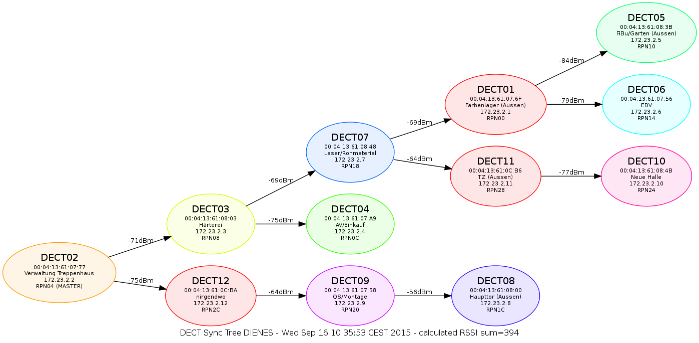

# SnomM700-TreeGraph
creates a nice png with the current tree configuration of the Snom M700 DECT basestations.

Requires: graphviz (http://www.graphviz.org)

Configuration:
--------------

    cp example.config.php example.config.php

Change values for base/user/pass, modify/add more location strings to location array.
The location array is used to give every basestation a meaningful description.

###### Here is an example image of a tree-graph:
[click here for a large image](https://raw.githubusercontent.com/saschaludwig/SnomM700-TreeGraph/master/example.png)

